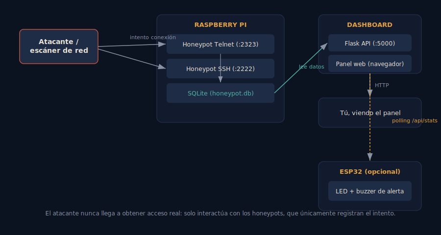

# 🕸️ Trampa — IoT Honeypot + Dashboard en tiempo real


Honeypot de baja interacción que simula servicios **SSH** y **Telnet**
vulnerables en una Raspberry Pi, registra cada intento de intrusión
(IP, credenciales probadas, geolocalización) y lo visualiza en un
**dashboard en tiempo real**. Opcionalmente, un **ESP32** enciende un
LED/buzzer físico cada vez que se detecta un nuevo ataque.

> El honeypot **nunca concede acceso real**: solo capta el intento de
> login y cierra la conexión. Es una herramienta puramente defensiva
> (blue team), pensada para entender qué tipo de tráfico malicioso
> llega a un dispositivo expuesto.



## ✨ Qué hace

- **Honeypot SSH** (puerto 2222) construido con `paramiko`: handshake
  SSH real, pero la autenticación siempre falla tras registrar usuario
  y contraseña.
- **Honeypot Telnet** (puerto 2323): simula el banner de login de un
  router/NVR doméstico típico.
- **Geolocalización** automática de cada IP atacante (país/ciudad).
- **Dashboard web** con: contador de intentos, IPs únicas, gráfico de
  intentos por hora, ranking de credenciales más probadas, ranking de
  IPs más activas y un *feed* tipo terminal en directo.
- **Alerta física opcional** vía ESP32 (LED + buzzer) cuando entra un
  ataque nuevo — conecta la parte software con la de hardware.

## 🧱 Arquitectura

```
Atacante → Honeypot SSH/Telnet (Raspberry Pi) → SQLite → API Flask → Dashboard web
                                                              ↓
                                                   ESP32 (LED/buzzer, opcional)
```

## 🔧 Hardware necesario

| Componente | Notas |
|---|---|
| Raspberry Pi (3/4/5 o Zero 2 W) | Corre el honeypot y el dashboard |
| ESP32 (opcional) | Solo para la alerta física |
| LED + resistencia 220Ω (opcional) | GPIO 2 |
| Buzzer activo (opcional) | GPIO 4 |

## 🚀 Instalación

```bash
git clone <tu-repo>
cd iot-honeypot-dashboard
python3 -m venv .venv && source .venv/bin/activate
pip install -r requirements.txt
```

### 1. Lanzar el honeypot

```bash
python run_honeypot.py
# escucha en :2323 (telnet) y :2222 (ssh)
```

### 2. Lanzar el dashboard (en otra terminal)

```bash
python dashboard/app.py
# abre http://<ip-de-tu-raspberry>:5000
```

### 3. (Opcional) Exponerlo como si fuera el puerto real

Como ejecutar en el puerto 23/22 real requiere privilegios root, es
más seguro redirigir tráfico con `nftables` en vez de correr Python
como root:

```bash
sudo nft add table ip nat
sudo nft add chain ip nat prerouting { type nat hook prerouting priority 0 \; }
sudo nft add rule ip nat prerouting tcp dport 23 redirect to :2323
sudo nft add rule ip nat prerouting tcp dport 22 redirect to :2222
```

> ⚠️ Si rediriges el puerto 22 real, asegúrate de que el **SSH legítimo
> de administración** de tu Raspberry Pi escucha en otro puerto, o te
> quedarás fuera.

### 4. (Opcional) Flashear el ESP32 de alerta

Abre `esp32_alert/esp32_alert.ino` en el IDE de Arduino, instala las
librerías `WiFi`, `HTTPClient` y `ArduinoJson`, edita `SSID`,
`PASSWORD` y `DASHBOARD_HOST`, y súbelo a la placa.

## 🛡️ Consideraciones de seguridad

- Despliega esto en un segmento de red controlado (DMZ / VLAN) si vas
  a exponerlo a internet — un honeypot mal aislado puede convertirse
  en un punto de pivote.
- Los logs (`data/honeypot.db`) contienen IPs reales; trátalos como
  datos sensibles si vas a publicarlos.
- Este proyecto está pensado con fines educativos y de investigación
  defensiva (blue team), no para atacar a terceros.

## 📂 Estructura del repositorio

```
iot-honeypot-dashboard/
├── honeypot/            # lógica de los honeypots SSH/Telnet
├── dashboard/            # backend Flask + frontend del panel
├── esp32_alert/           # firmware del aviso físico (opcional)
├── docs/                  # diagramas
├── run_honeypot.py
└── requirements.txt
```

## 🗺️ Posibles ampliaciones

- Persistir logs en PostgreSQL/TimescaleDB para series temporales largas.
- Añadir un honeypot HTTP simulando un panel de cámara IP.
- Exportar eventos a un SIEM (Wazuh, ELK) vía syslog.
- Mapa mundial real (Leaflet) en lugar de tabla de países.

## Licencia

MIT — úsalo, modifícalo y preséntalo libremente, citando el origen si
te ha sido útil.
